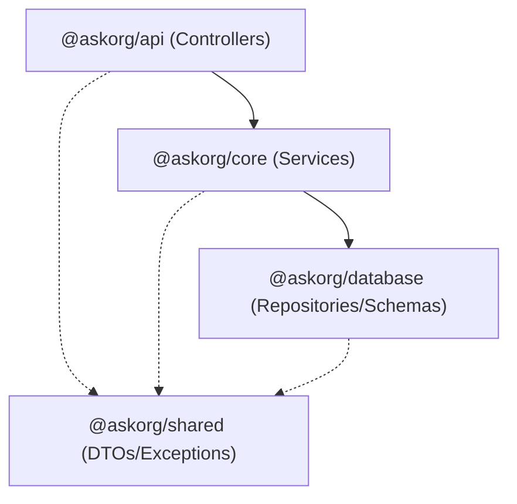

# AskOrg Backend

AskOrg is a centralized backend system built with a modern, high-performance tech stack. It utilizes a monorepo architecture with Bun Workspaces, ensuring a clean separation of concerns and robust dependency management.

## 🏗 Architecture Overview

The project follows a layered architecture, organized into separate workspace packages:

### 1. `@askorg/api` (API Layer)
*   **Framework**: [Express 5](https://expressjs.com/) with [TSOA](https://tsoa-community.github.io/docs/).
*   **Purpose**: Handles HTTP requests, routing, and input validation.
*   **Features**: 
    *   Automatic OpenAPI/Swagger documentation generation via TSOA.
    *   Dependency Injection using `tsyringe`.
    *   Validation using `Joi`.

### 2. `@askorg/core` (Business Logic Layer)
*   **Purpose**: Contains the core business logic and services (e.g., Auth, Post, Category).
*   **Connections**: Receives calls from the API layer and interacts with the Database layer via Repositories.

### 3. `@askorg/database` (Data Link Layer)
*   **ORM**: [Drizzle ORM](https://orm.drizzle.team/).
*   **Database**: PostgreSQL (hosted on [Neon](https://neon.tech/)).
*   **Purpose**: Manages database schemas, migrations, and repository implementations for data access.
*   **Features**: 
    *   Type-safe SQL queries.
    *   Migration management using `drizzle-kit`.

### 4. `@askorg/shared` (Common Layer)
*   **Purpose**: Shared utilities, Data Transfer Objects (DTOs), and custom Exception classes used across all packages.

---

## 🛠 Tech Stack

| Component          | Technology          |
|-------------------|---------------------|
| **Runtime**       | [Bun](https://bun.sh/) |
| **Language**      | TypeScript          |
| **API Framework** | Express + TSOA      |
| **ORM**           | Drizzle ORM         |
| **DB Service**    | Neon (PostgreSQL)   |
| **DI Container**  | tsyringe            |
| **Documentation** | Swagger / OpenAPI   |

---

## 🔗 Internal Workflow & Dependencies

The system follows a strict unidirectional dependency flow to maintain modularity:



1.  **Request Handling**: The `api` layer receives an HTTP request. TSOA handles routing and initial validation.
2.  **Service Execution**: The Controller calls a method in the `core` service layer, which is injected via `tsyringe`.
3.  **Data Operations**: The Service layer interacts with the `database` layer through Repository classes to fetch or mutate data.
4.  **Transformation**: All layers utilize `@askorg/shared` for standardized DTOs and error handling.

---

## 🚀 Getting Started

Ensure you have [Bun](https://bun.sh/) installed.

### 1. Installation
```bash
bun install
```

### 2. Setup Environment
Create a `.env` file in the root directory (refer to `.env.example` if available) with your `DATABASE_URL`.

### 3. Database Migrations
Generate and apply migrations:
```bash
bun run db:generate
bun run db:migrate
```

### 4. Running the Development Server
```bash
bun run dev
```
The API will be available at `http://localhost:3000`.
Swagger documentation can be found at `http://localhost:3000/docs`.

---

## 📜 Available Scripts

*   `bun run dev`: Starts the API server in development mode.
*   `bun run build`: Builds all workspace packages.
*   `bun run db:migrate`: Applies pending database migrations.
*   `bun run db:studio`: Opens Drizzle Studio to visualize the database.
