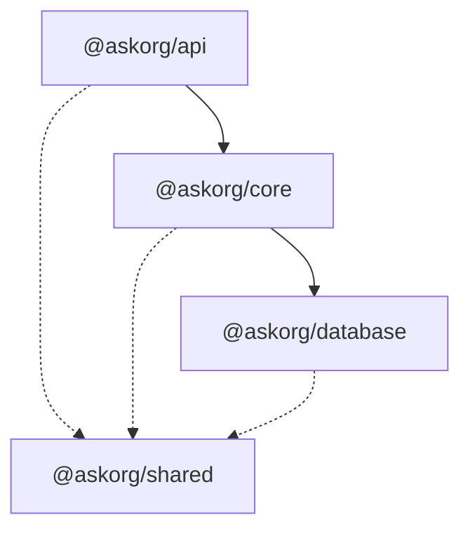

# AskOrg Backend

A centralized backend system built as a learning project to explore modern backend architecture patterns — monorepo structure, layered architecture, dependency injection, and type-safe database access.

---

## Architecture

The project is organized as a **Bun Workspace monorepo** with four packages, each responsible for a distinct layer of the application.

```
packages/
├── api/        → HTTP layer (Controllers, routing, Swagger)
├── core/       → Business logic (Services)
├── database/   → Data access (Repositories, schemas, migrations)
└── shared/     → Cross-cutting concerns (DTOs, exceptions)
```

### Dependency Flow



Dependencies flow in one direction only — no circular imports, no layer skipping.

---

### `@askorg/api` — HTTP Layer

Handles all inbound HTTP traffic. [TSOA](https://tsoa-community.github.io/docs/) generates routes and Swagger documentation automatically from TypeScript decorators. [tsyringe](https://github.com/microsoft/tsyringe) wires up controller dependencies at runtime.

- Express 5 + TSOA for routing and validation  
- Auto-generated OpenAPI / Swagger docs  
- Dependency injection via tsyringe  

### `@askorg/core` — Service Layer

Contains all business logic. Services are injected into controllers and call repositories for data access. No framework dependencies — pure TypeScript classes.

### `@askorg/database` — Data Layer

Manages database schemas, migrations, and all data access patterns via Repository classes. [Drizzle ORM](https://orm.drizzle.team/) provides fully type-safe query building with `.$dynamic()` support for composable filters.

- Drizzle ORM with PostgreSQL ([Neon](https://neon.tech/))  
- Migration management via `drizzle-kit`  
- Repository pattern for clean data access  

### `@askorg/shared` — Common Layer

Shared interfaces, DTOs, and custom exception classes (`NotFoundError`, etc.) used across all packages. No business logic lives here.

---

## Tech Stack

| Concern | Technology |
|---|---|
| Runtime | [Bun](https://bun.sh/) |
| Language | TypeScript |
| API Framework | Express 5 + TSOA |
| ORM | Drizzle ORM |
| Database | PostgreSQL (Neon) |
| DI Container | tsyringe |
| API Docs | Swagger / OpenAPI |

---

## Getting Started

Requires [Bun](https://bun.sh/) to be installed.

**Install dependencies**
```bash
bun install
```

**Configure environment**

Create a `.env` file in the root directory:
```env
DATABASE_URL=your_neon_postgres_connection_string
```

**Run migrations**
```bash
bun run db:generate
bun run db:migrate
```

**Start development server**
```bash
bun run dev
```

- API: `http://localhost:3000`  
- Swagger UI: `http://localhost:3000/docs`

---

## Scripts

| Command | Description |
|---|---|
| `bun run dev` | Start API in development mode |
| `bun run build` | Build all workspace packages |
| `bun run db:generate` | Generate migration files from schema changes |
| `bun run db:migrate` | Apply pending migrations |
| `bun run db:studio` | Open Drizzle Studio (visual DB browser) |

---

## Key Patterns Used

**Query Object Pattern** — All list endpoints accept a single `PostQueryDto` object instead of individual parameters. Filters (`search`, `category`), pagination (`page`, `limit`) are composable and extensible without touching controller or service signatures.

**Repository Pattern** — All database access is encapsulated in Repository classes. Services never import Drizzle or write SQL directly.

**Paginated Responses** — `getAll` endpoints return a `PaginatedResult<T>` envelope with `data` and `meta` (total, page, totalPages, hasNext, hasPrev).

**Layered Exception Handling** — Custom exceptions (`NotFoundError`, etc.) are thrown in the service layer and caught by a central Express error handler.